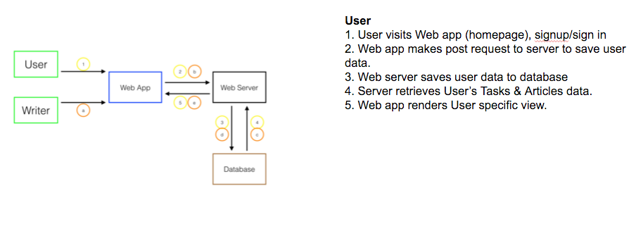

# New-City

##Overview

A web app for housing that provides reliable and personalized contents to users. 
The website is built on Django and user information is retreived using Facebook's Graph API.

##Scenario 
Housing problems are common for new millenials who move to new cities after graduation. 
Websites like Craigslist succesfully connect buyers and sellers but users usually
need to be aware of scams. Through Facebook integration, users feel more secure 
because the identity of sellers (homeowners) is more transparent. Also, personalized 
content of the website helps users make more informed decision. 

##Team Members
Jin Hoon Bang, Olivia Lim, Andre Paim, Sunghyuk Park, Ethan Suh, Rachel Xanttopoulos

##Current State 
Currently, there are two versions of our website. One of them is avaialble on 
newcity.parseapp.com and uses Parse as backend. Also, we have an website with
using Django that is currently under development. 

##Architecture Diagram 

##Install 

##Issues
Please direct all your issues/questions to https://github.com/nuvention-web/new-city/issues
